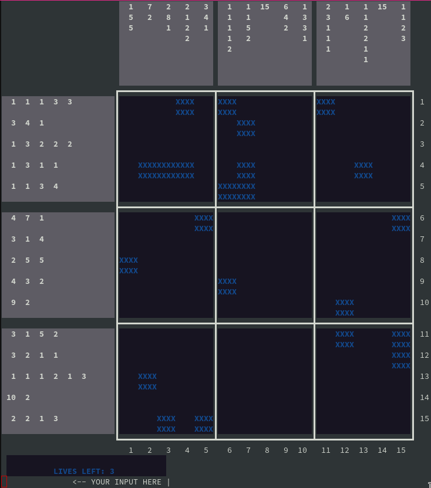

# NONOGRAM

## Description

Nonogram, also known as pixel puzzle, is a puzzle-like game based on a grid 
filled with full and empty cells, the player needs to find all the alive cells
based on logical conclusions based on the given number of filled sections in 
each line and column, as represented in the images:

;
;

## ROADMAP

- [x] print function working
- [x] modularize so it's possible to add other themes
- [x] game logic working
- [x] coordinates can be given by range
- [x] Make the game stop on end
- [x] Filters player input based on boundaries (input not bigger than n or less than 0)
- [x] Make a difficult system based on size of grid and revealed cells
- [x] Add more themes
- [ ] Add *save drawing* functionality
- [ ] Add *create drawing* functionality
- [x] Refactor print functions to use ansi characters and make them less dumb
- [x] Substitute system("clear") by ansi characters
- [x] Make an error/usage output function
- [ ] Add comments in all files so my code is more clear
